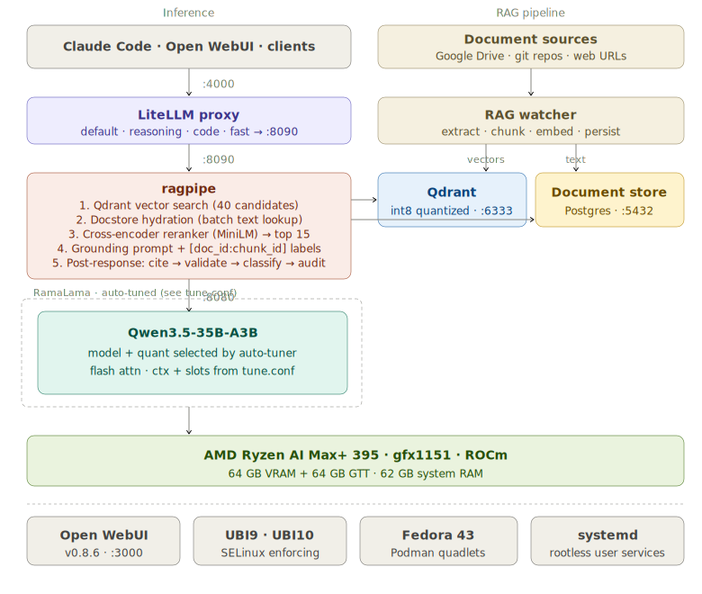

# framework-ai-stack

Local AI stack for Fedora 43 on the Framework Desktop (Ryzen AI Max+ 395, 128 GB unified memory). Qwen3.5-35B-A3B inference with live RAG — a watcher automatically imports documents from Google Drive, git repos, and web URLs into a Qdrant vector database backed by a Postgres document store. A RAG proxy searches Qdrant, hydrates chunks from the document store, reranks with a cross-encoder, and injects the most relevant context into every query. All services run as rootless Podman containers managed by systemd quadlets.



## Stack

| Service | Image | Port | Notes |
|---|---|---|---|
| postgres | `quay.io/sclorg/postgresql-16-c9s` | 5432 | LiteLLM state + document store |
| qdrant | `docker.io/qdrant/qdrant` | 6333 | Vector search (int8 scalar quantization) |
| ramalama | `quay.io/ramalama/rocm:latest` | 8080 | Qwen3.5-35B-A3B UD-Q4\_K\_XL (~22 GB, q8\_0 KV cache) |
| rag-proxy | `ubi9/python-311` (pinned digest) | 8090 | Qdrant search → docstore hydration → reranker → context injection |
| litellm | `ghcr.io/berriai/litellm:main-stable` | 4000 | OpenAI-compatible proxy |
| open-webui | `ghcr.io/open-webui/open-webui:v0.8.6` | 3000 | Chat UI, pinned to v0.8.6 |
| rag-watcher | `ubi10` | — | Ingests from Drive, git repos, and web URLs into docstore + Qdrant |

Models are pulled and managed by [RamaLama](https://github.com/containers/ramalama). LiteLLM routes all aliases through the RAG proxy. The proxy searches Qdrant for candidate vectors (reference payloads only — no text stored in Qdrant), hydrates chunk text from the Postgres document store, reranks with BAAI/bge-reranker-v2-m3, and injects the top results as context before forwarding to the model. Documents from Google Drive, git repos, and web URLs are automatically ingested — no model restart required.

## Prerequisites

- Fedora 43
- AMD Ryzen AI Max+ 395 (gfx1151) or similar AMD iGPU/dGPU with ROCm support
- ~25 GB free disk space for the model
- **BIOS: UMA frame buffer set to 64 GB — model uses ~22 GB VRAM, leaving ~42 GB VRAM headroom for KV cache and ~62 GB system RAM**

## First-time setup

```bash
git clone https://github.com/aclater/framework-ai-stack
cd framework-ai-stack
chmod +x llm-stack.sh

./llm-stack.sh deps          # install system packages (sudo)
./llm-stack.sh groups        # add user to render/video (sudo + reboot)
./llm-stack.sh setup         # verify GPU, write configs
./llm-stack.sh pull-image    # pull the RamaLama ROCm container image
./llm-stack.sh pull-models   # download model (~22 GB)
./llm-stack.sh install       # install quadlets to systemd + fix SELinux labels
./llm-stack.sh up            # start everything

# Optional: set up the Google Drive RAG watcher
./rag-watcher/setup.sh       # interactive setup for Drive polling
```

## Usage

```
./llm-stack.sh <command>

  deps            install system packages via dnf
  groups          add user to render/video groups
  setup           verify GPU, configure dirs
  pull-image      pull RamaLama ROCm image (with registry fallback)
  pull-models     download model
  install         install quadlets + enable on boot
  up              start all services
  down            stop all services
  restart         restart all services
  status          show unit states
  test            smoke-test inference
  logs <service>  follow logs  (model|proxy|webui)
  swap <model>    hot-swap the model
  uninstall       remove quadlets (models kept)
```

## Claude Code integration

Point Claude Code at the LiteLLM proxy:

```bash
export OPENAI_API_BASE=http://localhost:4000
export OPENAI_API_KEY=sk-llm-stack-local
```

Available model aliases (all route to Qwen3.5-35B-A3B on :8080):

| Alias | Use case |
|---|---|
| `default` | General use |
| `reasoning` | Multi-step problems, chain-of-thought |
| `code` | Completion, debugging, generation |
| `fast` | Quick queries, drafting |

## Hardware notes

**gfx1151 (AI Max+ 395):** ROCm 6.4.x in Fedora 43 has known page-fault issues on gfx1151. `HSA_OVERRIDE_GFX_VERSION=11.5.1` is set automatically by `./llm-stack.sh setup`. A fix is expected in ROCm 7.x (Fedora 44). If you hit errors, check `./llm-stack.sh logs model`.

**Memory budget:** Qwen3.5-35B-A3B UD-Q4\_K\_XL uses ~22 GB VRAM. With a 64/64 BIOS split, this leaves ~42 GB of VRAM headroom for KV cache (131072 context, parallel 4) and ~62 GB of system RAM for applications. Do **not** set `LLAMA_HIP_UMA=1` — on the AI Max+ 395 with dedicated VRAM carved out in BIOS, it forces allocations into GTT (system RAM) instead of VRAM.

**SELinux:** The ramalama quadlet requires `SecurityLabelDisable=true` because SELinux blocks `/dev/kfd` access in the user systemd context. `cmd_install` automatically runs `chcon -t container_ro_file_t -l s0` on all `.gguf` model files.

**quay.io outages:** `pull-image` automatically falls back to `ghcr.io/ggml-org/llama.cpp:full-rocm` if quay.io is unreachable. quay.io status: https://status.redhat.com

## Implementation notes

**LiteLLM** uses `main-stable` (currently v1.82.3-stable.patch.2), backed by sclorg/postgresql-16-c9s. It is not pinned to a specific version tag.

**Postgres** serves double duty: LiteLLM state and the RAG document store (chunks table). The document store uses upsert semantics on `(doc_id, chunk_id)` so re-ingestion is idempotent.

**Qdrant** stores vectors with reference-only payloads `{doc_id, chunk_id, source, created_at}` — no document text. The collection uses int8 scalar quantization (quantile 0.99, always\_ram) to reduce vector memory footprint. Qdrant does not support adding quantization to an existing collection — recreate if migrating.

**Reranker** uses BAAI/bge-reranker-v2-m3 (0.6B, Apache 2.0, multilingual) as a cross-encoder to score query-document pairs after vector retrieval. Configurable via `RERANKER_MODEL` env var; can be swapped to bge-reranker-v2.5-gemma2-lightweight or mxbai-rerank-large-v2. Disabled via `RERANKER_ENABLED=false`.

**Open WebUI** is pinned to v0.8.6. It uses `DATABASE_URL=sqlite:////app/backend/data/webui.db` (not the postgres instance). It runs on port 3000 via `PORT=3000` because `Network=host` would otherwise conflict with ramalama on :8080.

**Environment variables:** `OPENAI_API_KEY` and all shared secrets live in `env.example` / `~/.config/llm-stack/env`. Systemd does not expand `EnvironmentFile` vars inside `Environment=` lines, so all vars that need cross-referencing must be set directly in the env file.

## AIMI (Chatterbox Labs / Red Hat)

A stub service slot is reserved for the [AIMI](https://www.redhat.com/en/about/press-releases/red-hat-accelerates-ai-trust-and-security-chatterbox-labs-acquisition) guardrails platform once it becomes available via Red Hat channels. See the commented block in `configs/litellm-config.yaml`.

## Acknowledgements

Document loading patterns (git shallow clone with incremental pull, web extraction, chunking with source attribution) are adapted from the [Red Hat Validated Patterns vector-embedder](https://github.com/validatedpatterns-sandbox/vector-embedder).

## License

MIT
